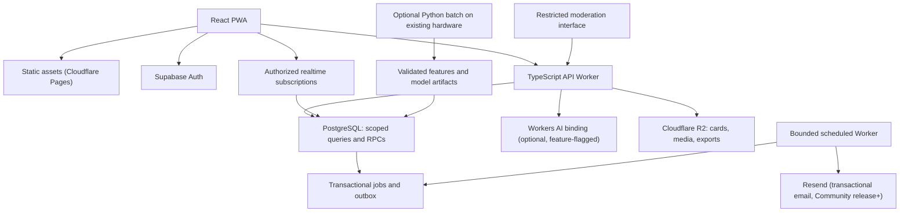

# Heatt — Product & Engineering Specification (v2: The Delight Layer)

**Where your mind catches fire.**

This is a complete, standalone specification. It folds in everything from the original zero-investment architecture and adds a new layer of features chosen for one reason: they make Heatt more useful and more fun to return to *without* reintroducing the manipulative mechanics the original design deliberately rejected. Nothing here requires paid infrastructure. Where an optional AI capability is used, it runs on a free-tier provider with a fully functional non-AI fallback.

---

## 0. What's new in this revision

| Category | Addition |
|---|---|
| New features | 12 additions: Curiosity Trail, Discovery Roulette, Highlight & Annotate, Practice Journeys, Reading Circles, Ask the Room, Practice Pulse, Constellation View, Time Capsule Reflections, Kindred Rooms, Reflection Companion, Community Translations |
| New principles | "Progress without pressure" and "Collective without competitive" — added because several new features needed an explicit ethical rule to be built correctly |
| Infrastructure upgrades | Cloudflare R2 (free object storage with zero egress fees) added for cards and media; Cloudflare Workers AI (free, key-less inference) added as the engine behind the optional Reflection Companion; Resend added for the small volume of transactional email the Community release requires |
| Numbers refreshed | Every free-tier figure in this document was checked against each provider's own pricing or docs pages in September 2026. Free tiers change; re-verify before you rely on one for a launch date. |

Nothing below removes a safeguard from the original design. Every new feature was screened against the same principles that corrected the original vision — if a feature idea failed that screen, it isn't here. (A handful of rejected ideas, and why they were cut, are in the companion architecture PDF.)

---

## 1. Product identity

**Name:** Heatt
**Tagline:** Where your mind catches fire.
**Promise:** A small moment of expression, connection, or insight that leaves your day better.

Heatt is a thoughtful social network with a strong recommendation system — not an AI app that happens to contain a feed, and not an engagement-maximizing entertainment platform. It is not therapy or a religious authority.

---

## 2. Product principles

| Principle | Product consequence |
|---|---|
| Value over time spent | Optimize worthwhile sessions, not endless scrolling |
| Explicit preferences beat guesses | User-selected topics override weak behavioral inference |
| Privacy before personalization | No recommendation mining of DMs, journals, or circle content |
| Human expression first | No synthetic users, no undisclosed AI-generated activity |
| Understandable discovery | Explain why content appeared and allow correction |
| Delight without pressure | No broken-streak penalties, no spending-based boosts |
| Graceful degradation | Feed, posting, and wisdom work without AI or realtime |
| Accessible by default | Motion, color, and sound are never required to understand content |
| **Progress without pressure** *(new)* | Progress mechanics count what a person has explored, never what they failed to do. Nothing resets. Nothing shames a gap. |
| **Collective without competitive** *(new)* | Social-proof features may show that others are engaged too. They never show a ranked list of *who*, and never pit people against each other. |

---

## 3. The six existing pillars (recap)

1. **Micro-expression** — short posts, reflections, questions, poetry (500 grapheme-cluster limit, enforced client and server).
2. **Intentional discovery** — a personalized feed with visible controls; ADR 0003 replaces the cold-start stopping point with an honest, continuously loading open-web catalog while keeping community pages bounded.
3. **Daily wisdom** — sourced ideas with context, attribution, and a practical reflection.
4. **Small communities** — rooms and private circles that lower the intimidation of posting.
5. **Meaningful conversation** — replies, message requests, time-boxed Sparks.
6. **Beautiful sharing** — user-controlled, client-rendered cards that carry ideas outside the app.

Sections 5–11 describe how the new features attach to each pillar. Section 4 introduces them properly first.

---

## 4. The Delight Layer — 12 new features

Every feature below states what it is, which principle it answers to, how it's built, and what it costs. None require a new paid vendor.

### 4.1 Curiosity Trail
*Replaces the instinct toward "streaks."*
A trail that only grows: it counts **distinct topics, traditions, and rooms explored**, not consecutive days. Waypoints unlock at diversity milestones ("5 traditions explored," "3 practice journeys tried"). Missing a day changes nothing — there is no daily requirement, no broken chain, no red warning icon.
*Build:* an append-only `curiosity_trail_events(user_id, event_type, topic_id, occurred_at)` table; a small scheduled job (reusing the existing bounded-worker pattern) recomputes `user_trail_progress(user_id, distinct_topics, distinct_rooms, distinct_traditions, waypoints_unlocked jsonb)`.
*Cost:* $0 — one more consumer of the outbox/job pattern already in the architecture.

### 4.2 Discovery Roulette (with swipe left or right, make it interesting)
A "Surprise me" button on the For You feed. It draws one post from the same low-certainty exploration pool the ranker already samples from for its own controlled exploration — this feature just hands the user manual, on-demand access to it instead of waiting for the algorithm to decide when to show it.
*Build:* one new endpoint, `GET /discovery/roulette`, applying the same eligibility and authorization gate as the main feed. No new pipeline.
*Cost:* $0 — one extra bounded query.

### 4.3 Highlight & Annotate
Select a span of text in a post, wisdom entry, or an approved Spark excerpt, and save it straight to the Journal with a private note attached — turning reading into collecting.
*Build:* standard browser/native text-selection UI; a `journal_entries` row storing `source_type, source_id, quoted_span, note`. Highlighting a *public* post may optionally contribute a save-equivalent signal to that post's exposure-adjusted quality score (§17), but the private note text itself never leaves the Journal or enters recommendation training — consistent with the existing privacy boundary.
*Cost:* $0 — UI plus one table extension.

### 4.4 Practice Journeys
A themed, opt-in sequence of 5–7 wisdom entries and practices — "7 Mornings of Stoic Discipline," "A Week of Noticing." Each day unlocks the next entry; missing a day doesn't break anything, the next entry simply waits. Completing a journey adds a Curiosity Trail waypoint.
*Build:* `practice_journeys(id, title, description, day_count, path_type, rights_status)`, `journey_days(journey_id, day_number, wisdom_entry_id, practice_text)`, `journey_enrollments(user_id, journey_id, current_day, started_at, completed_at)`.
*Cost:* editorial production time; no new infrastructure class.

### 4.5 Reading Circles
Small, opt-in groups (roughly 5–15 people) who read the same wisdom entry across a week and leave threaded reflections visible only to circle members — slower and more intimate than a Room, lower-commitment than a DM. Formed by direct invitation or by opting into a matched cohort for a given wisdom path.
*Build:* `reading_circles(id, wisdom_entry_id, capacity, visibility, created_by)`, `circle_memberships(circle_id, user_id, joined_at)`, `circle_reflections(circle_id, user_id, content, posted_at)`. Reflections follow the exact privacy rule already governing circles and DMs: excluded from public discovery, search, and recommendation training.
*Cost:* $0 — relational data reusing the existing private-circle authorization pattern.

### 4.6 Ask the Room
A structured Q&A post subtype. Within a Room, a "Question" post collects "Answer" replies, and the original asker can mark any number of them "Helpful" — visibly tagged, without hiding or deleting the rest. Usefulness, not popularity, drives visibility.
*Build:* extends the existing "Question" post type with `answer_marks(post_id, reply_id, marked_helpful_by, marked_at)`.
*Cost:* $0 — a small schema addition.

### 4.7 Practice Pulse
An anonymized, aggregate counter on a wisdom entry's "Try it today" practice: *"482 people tried this today."* No leaderboard, no per-user visibility, and the count is suppressed entirely below a k-anonymity floor (for example, fewer than 20 distinct tries) so it can never be used to infer who, specifically, did something.
*Build:* `practice_pulse_counts(wisdom_entry_id, date, distinct_tries)`, refreshed every few minutes by a scheduled worker reading from the existing "tried it" flags — no realtime sockets, no Redis.
*Cost:* $0 — a small aggregation job.

### 4.8 Constellation View
A private-by-default, personal visual: a node map of the topics, traditions, and rooms a user has actually engaged with, sized by depth and clustered by theme — a visual autobiography of their curiosity. Rendered entirely client-side (Canvas/SVG) from the user's own affinity data, the same zero-server-rendering approach already used for cards. Exportable as a card.
*Build:* computed on demand from existing `usertopicaffinities`; if the optional local-embedding batch job (§19) is running, node positions can use a cheap nightly dimensionality reduction of the interest vector, otherwise a simple topic-count layout.
*Cost:* $0 — no new server infrastructure, purely client rendering.

### 4.9 Time Capsule Reflections
Write a private reflection — or select a highlighted quote — and schedule it to resurface to yourself in a week, a month, or a year. With explicit mutual opt-in, it can be addressed to a specific friend to open on that date instead.
*Build:* `time_capsules(id, author_id, recipient_id nullable, content, reveal_at, opened_at, visibility)`. A scheduled worker checks `reveal_at <= now()` and enqueues a notification through the existing outbox pattern. Sending to another person requires their prior explicit consent before the send action even becomes available in the UI — the same consent gate Sparks already use.
*Cost:* $0 — reuses the existing job infrastructure.

### 4.10 Kindred Rooms
Opt-in room recommendations — "Rooms you might like" — based on topic-affinity overlap with rooms a user hasn't joined. Unlike matching people by preference (which the original spec correctly treats as sensitive), this only ever recommends *public rooms*, never other users, so it carries none of that risk.
*Build:* a cosine-similarity query over existing `usertopicaffinities` and each room's topic vector — a new scored candidate source in the existing recommendation pipeline (§17), not a new pipeline.
*Cost:* $0.

### 4.11 Reflection Companion — the optional, free-tier AI layer
An explicitly optional, user-initiated assistant. It never runs automatically and is never on any critical path. What it does, only when tapped:
- Suggests two or three alternate phrasings for a gentle prompt or a draft post ("Help me start")
- Drafts a short, source-grounded expansion of a wisdom entry's context — a *draft*, still subject to the same editorial-approval gate before anything becomes canonical wisdom copy
- Drafts an optional Spark-conversation summary, still gated on every participant's approval, exactly as the original spec required

**Why this can be genuinely free:** the API already runs on Cloudflare Workers. Cloudflare Workers AI is a binding — `env.AI.run()` — not a hosted API with a key to provision, rotate, or leak. It gives every account **10,000 free "neurons" per day**, resetting at 00:00 UTC, with no card required, and hosts open models (Llama 3.1 8B, Llama 3.3 70B fp8, Mistral 7B/Small 3.1, Gemma 3 12B, DeepSeek R1 Distill, GPT-OSS) that are entirely sufficient for short, user-initiated completions. At beta scale, a few thousand of those completions a day fits comfortably inside the free allocation.

**Backpressure, not a bill:** a small usage-counter job (same pattern as the quota policy in §20) tracks daily neuron consumption. When the allocation is close to exhausted, the feature disables itself — the person sees "the assistant is resting today," never an error — and the manual fallback (the editorial prompt library, manual excerpt selection) takes over silently.

**Documented fallback/alternative:** Google AI Studio's free Gemini tier (Gemini 2.5 Flash: 500 requests/day at 15 RPM; text-embedding-004: 1,500 requests/day) is a viable second option if a task ever needs a stronger model than Workers AI hosts. It introduces a real API key and a second vendor to manage, so it stays optional-of-the-optional — reach for it only if Workers AI is measurably insufficient, not by default.

**Guardrails:** all retrieved and user-supplied text is treated as untrusted data, never as instructions. The Companion never publishes directly to a public surface. Every completion logs which model and version served it. Companion output passes through the same moderation queue as community submissions before it becomes user-facing.

*Cost:* $0 at beta scale; the design fails toward "feature pauses" rather than "surprise bill" if usage grows.

### 4.12 Community Translations
Crowdsourced translation of already rights-cleared wisdom entries into additional languages, entering the same moderation queue as community-submitted quotes, with translators credited the same way community contributors already are. A translation can never be published if the *source* entry lacks redistribution rights — translating doesn't create new rights.
*Build:* `wisdom_translations(wisdom_entry_id, language, translated_text, translated_by, status)`.
*Cost:* $0 — editorial and moderation labor only, no translation API.

---

## 5. Onboarding (unchanged, plus one addition)

The two-minute welcome (topics, styles, languages, optional session intent, privacy defaults) is unchanged. At the end of a person's first session, Heatt now shows the Curiosity Trail for the first time — empty, with its first waypoint one topic away — rather than a streak counter starting at zero.

## 6. Feed (unchanged, plus two additions)

For You / Following / Rooms views, the Feed Tuner, and "Why this appeared" are unchanged. Two additions:
- A **Discovery Roulette** button remains available on bounded community feeds; the open-web cold-start feed instead appends reviewed source batches automatically.
- A **Kindred Rooms** rail can appear after bounded community results, always opt-in and dismissible; the open-web rail shows real publishers without fabricated member counts.

## 7. Posting (unchanged, plus two additions)

Post types, gentle prompts, and reply invitations are unchanged. Additions:
- **Highlight & Annotate** works on any readable surface, not just posting.
- The **Question** post type gains the **Ask the Room** answer-marking behavior.

## 8. Wisdom with provenance (unchanged, plus four additions)

Provenance requirements (exact text and attribution, source and rights status, separated context, clearly labeled interpretation, optional practice, language notes) are unchanged and non-negotiable. Additions woven into this pillar:
- **Practice Journeys** bundle entries into a guided sequence.
- **Reading Circles** give a small group a shared, private space to sit with one entry.
- **Practice Pulse** shows anonymized collective momentum on the daily practice.
- **Community Translations** extend the rights-cleared library into more languages.

## 9. The private Wisdom Journal (unchanged, plus two additions)

Private by construction, excluded from discovery and training, exportable and deletable independently of public posts — unchanged. Additions:
- **Highlight & Annotate** entries populate it directly from reading.
- **Time Capsule Reflections** live alongside it as a scheduled, resurfacing form of private writing.

## 10. Conversations (unchanged)

Message requests, Sparks, blocking/muting/reporting are unchanged. Reading Circles are explicitly a different surface from Sparks: Sparks are a 24-hour, invite-only, ephemeral-feeling chat; Reading Circles are slower, wisdom-anchored, and have no expiry.

## 11. Shareable cards (unchanged, plus one addition)

Client-side, deterministic, template-rendered cards are unchanged. The **Constellation View** adds a new exportable card type: the personal node-map, rendered the same way every other card is — no server image rendering, no new cost.

---

## 12. Design system & accessibility

| Element | Direction |
|---|---|
| UI/UX/Animation/Motion | Generate all the necessary content based on reference ui images and videos in artifacts folder!!! Generate cool, fun and interesting ui components that gets more user, more close to real apps, but better ui|
| Curiosity Trail | A path, not a bar — waypoints, not percentages; never rendered in red or with a "broken" state |
| Practice Pulse | A quiet number, not a badge or a ranking; disappears below the anonymity floor rather than showing "a few people" |
| Constellation View | Rendered in the same cream/charcoal/ember palette as the rest of the app — this is a personal artifact, not a data-visualization showcase |
| Ask the Room | "Helpful" is a tag, not a score; it never reorders replies below a reasonable recency floor |

Keyboard users must be able to set Fire intensity, mark an answer helpful, and schedule a Time Capsule without relying on long-press or hover-only affordances. Screen readers announce state, not decoration.

---

## 13. Architecture overview

Still a modular monolith with managed PostgreSQL and an optional offline Python learning pipeline. The only structural addition is object storage and an optional AI binding — both chosen specifically because they attach to infrastructure the app already runs on, rather than introducing a new service.

### Selected stack

| Layer | Choice | Reason |
|---|---|---|
| Web client | React, TypeScript, Vite, PWA, React Native, TailwindCSS, Native Animated,  Motion and Animations| Fast text-first, with visuals, cool animations and motions product, portable static hosting |
| API | TypeScript, Hono on Cloudflare Workers | Thin, edge-compatible, explicit boundaries |
| Database | Supabase PostgreSQL | Relational integrity, auth integration, RLS |
| Authentication | Supabase Auth | Avoids implementing sessions/passwords from scratch |
| Search | PostgreSQL full-text search | No separate search service |
| Vectors | pgvector, introduced when justified | Semantic data stays beside access rules |
| **Object storage** | **Cloudflare R2** | 10 GB free storage and, critically, **zero egress fees** — cards get shared and re-downloaded constantly, and Supabase's egress budget is needed for the feed API, not image delivery |
| **Optional AI** | **Cloudflare Workers AI binding** | Same runtime as the API already uses; no separate API key; 10,000 free neurons/day; degrades to a manual fallback instead of erroring |
| **Transactional email** | **Resend** | 3,000 free emails/month is enough for password resets and opt-in digests at beta scale; introduced only at the Community release milestone, when it's first needed |
| Card rendering | Browser SVG/Canvas | No server image-rendering dependency |
| Background work | PostgreSQL jobs + transactional outbox | No Redis or Kafka requirement |

Nothing here changes the earlier decision to avoid Node/Mongo/Kafka/microservices. Two new lines were added to the stack because they were free, native to infrastructure already in use, and solved a specific, named problem (egress cost for shareable images; a vendor-free path to optional AI).

---

## 14. Domain model

| Domain | Principal tables |
|---|---|
| Identity | profiles, user_preferences, user_settings |
| Social graph | follows, blocks, mutes |
| Communities | rooms, room_memberships, circles, circle_memberships |
| Publishing | posts, post_revisions, replies, post_topics, **answer_marks** |
| Reactions | fires, bookmarks |
| Wisdom | wisdom_entries, wisdom_sources, wisdom_deliveries, journal_entries, **wisdom_translations** |
| **Journeys & circles** | **practice_journeys, journey_days, journey_enrollments, reading_circles, circle_reflections** |
| **Progress** | **curiosity_trail_events, user_trail_progress, practice_pulse_counts** |
| **Time & consent** | **time_capsules** |
| Messaging | conversations, conversation_members, messages, message_requests |
| Sparks | spark_sessions, card_proposals, card_approvals |
| Discovery | feed_events, user_topic_affinities, post_features, model_versions |
| **AI oversight** | **companion_usage_log** (model, version, feature surface, neuron count, timestamp — no content is logged) |
| Safety | reports, moderation_cases, enforcement_actions, appeals |
| Operations | outbox_events, jobs, idempotency_keys, audit_events |

New tables in bold. All use UUID identifiers, UTC timestamps, explicit foreign keys, and database-enforced constraints, exactly like the rest of the schema.

---

## 15. Important invariants

Carried forward, unchanged:
- Posts have a clear audience; impossible visibility combinations are rejected by constraint.
- Reactions are unique: one Fire per user per post, intensity 1–3.
- Membership controls reading for circles, messages, and private assets.
- Deletion removes discoverability everywhere — feed caches, search, embeddings, share previews, jobs.
- Blocks apply broadly: feed, replies, mentions, messages, context suggestions.
- Counters are derived; reaction records remain authoritative.

New, added for this revision:
- **Curiosity Trail counters only increase.** No code path resets or decrements them.
- **Practice Pulse counts are suppressed below the anonymity floor** and are never joined to individual identities in any response.
- **Time Capsules addressed to another person require that person's prior explicit consent** before the send action is even exposed in the UI.
- **Reading Circle and Time Capsule content follow the DM/journal privacy rule**: never enters public discovery, search, or recommendation training.
- **The Reflection Companion is called only by an explicit, user-initiated action** in the same request cycle — never in the background, never speculatively.
- **Every Companion-touched surface has a working non-AI fallback**, and the feature disables itself above quota rather than erroring.
- **Community translations cannot be published if the source entry lacks redistribution rights.**

---

## 16. API surface (additions)

All existing endpoints (feed, posts, reactions, preferences, wisdom, community, safety, privacy) are unchanged — cursor-paginated, idempotency-keyed where they mutate, transactional where they touch more than one invariant. New surface for this revision:

| Area | New operations |
|---|---|
| Discovery | `GET /discovery/roulette`, `GET /discovery/kindred-rooms` |
| Progress | `GET /trail`, `GET /journeys`, `POST /journeys/:id/enroll`, `POST /journeys/:id/advance` |
| Circles | `POST /circles`, `POST /circles/:id/join`, `POST /circles/:id/reflections` |
| Q&A | `POST /posts/:id/answers/:replyId/mark-helpful` |
| Journal | `POST /journal/highlights`, `POST /time-capsules`, `GET /time-capsules/due` |
| Companion | `POST /companion/suggest` (feature-flagged, rate-limited per user, always logs model/version, never content) |
| Wisdom | `POST /wisdom/:id/translations` (enters moderation queue) |

---

## 17. Recommendation engine (recap + two additions)

The three-stage funnel — bounded candidate generation → interpretable cold-start scoring → MMR diversity re-ranking — is unchanged from the original design, including the exposure-adjusted quality estimator (Bayesian shrinkage on distinct-reader response, not raw reaction counts) and the manipulation-resistant, time-decayed heat score. See §9 of the original specification for the full formulas; they are not repeated here because nothing about them changed.

Two additions:
- **Kindred Rooms** is a new, low-cost candidate *source* (§4.10) — a cosine-similarity lookup, not a new model.
- **Discovery Roulette** is a new *consumer* of the existing exploration pool (§4.2) — it doesn't change what gets explored, only who can request it on demand.

As before: public discovery only. DMs, journals, private-circle content, and Reading Circle reflections never become candidates, and the final authorization check before serving a feed is defense in depth, not permission to retrieve private content indiscriminately.

---

## 18. Wisdom selection algorithm (recap + additions)

Unchanged: filter to approved, rights-cleared entries in the user's language and chosen paths; exclude recently delivered entries and hidden authors; weight by mix preference and topic affinity; diversify across weeks; select deterministically per local day, generated lazily on first request.

Additions: journey-enrolled users receive their next unread journey day instead of (or alongside) the standalone daily entry; entries with translations available in the user's selected language are preferred over untranslated originals when both are otherwise equally ranked.

---

## 19. AI, RAG, and the Reflection Companion — full detail

No generative AI sits on the critical path. This section consolidates the AI posture across the whole product.

| Capability | Baseline (always works) | Optional enhancement |
|---|---|---|
| Writing starters | Editorial prompts | Companion-suggested phrasings, user-initiated |
| Wisdom context | Reviewed editorial text | Companion-drafted expansion, editorially reviewed before publish |
| Feed | Rules-based ranker | Embeddings and evaluated learned ranking, added only when justified |
| Conversation cards | Manual excerpt selection | Companion-drafted summary, gated on every participant's approval |
| Moderation | Rules, reports, human review | Classifier-assisted triage |
| Wisdom translation | Human community translation | (no AI shortcut — translation quality and rights are too sensitive for an unreviewed model draft to touch first) |

**Where the compute lives:** Cloudflare Workers AI, called as a binding from the existing API Worker — `env.AI.run()`, no separate key. 10,000 free neurons/day, resetting at 00:00 UTC, hosting open models sufficient for short, user-initiated tasks. A documented fallback (Google AI Studio's free Gemini tier — 500 req/day on Gemini 2.5 Flash, 1,500 req/day on the free embedding endpoint) exists for the day a task genuinely needs a stronger model, but adopting it means managing a second vendor's key, so it is not the default.

**Discipline that doesn't change with the vendor:**
- Treat all retrieved and user-supplied content as untrusted data, never as instructions that can authorize tool access or disclose secrets.
- Never invent citations, verses, attributions, or testimonials.
- AI output that could affect published wisdom requires editorial approval; AI moderation suggestions are advisory, never automatically authoritative.
- Log model and version per completion (for evaluation), never the content itself in that log.
- Every AI-touched surface must degrade to a fully functional non-AI path, and must do so *silently* — a paused feature, not a visible error.

LangChain/LangGraph-style orchestration remains optional and is not introduced for this revision; the Companion's tasks (short suggestion, draft expansion, gated summary) are simple enough for direct calls with explicit validation, and adding a workflow framework before multi-step branching/retry logic is actually needed would be exactly the kind of premature infrastructure this whole document argues against.

---

## 20. Free infrastructure plan

Baseline recurring spend: **$0**, within enforced quotas, assuming an existing development machine and internet connection.

| Component | Zero-spend choice | Verified limit (Sept 2026) |
|---|---|---|
| Frontend | Cloudflare Pages | 500 builds/month, 20,000 static asset files |
| API | Cloudflare Workers (Free) | 100,000 requests/day, 10 ms CPU time/request, 128 MB memory, 50 external subrequests/request |
| Data & auth | Supabase (Free) | 500 MB database, 1 GB file storage, 5 GB egress, 5 GB cached egress, 50,000 MAU, 500,000 Edge Function invocations/month, 200 concurrent realtime connections, 2 active projects (paused after 7 days idle) |
| **Object storage (cards, media, exports)** | **Cloudflare R2 (Free)** | **10 GB storage/month, 1,000,000 Class A operations/month, 10,000,000 Class B operations/month, zero egress fees, forever free** |
| **Optional AI (Reflection Companion)** | **Cloudflare Workers AI (Free)** | **10,000 neurons/day, resets 00:00 UTC, no card required** |
| Optional AI fallback | Google AI Studio (Free Gemini tier) | Gemini 2.5 Flash: 500 req/day @ 15 RPM; text-embedding-004: 1,500 req/day @ 100 RPM |
| **Transactional email** *(from Community release)* | **Resend (Free)** | **3,000 emails/month, capped at 100/day, 1 verified domain** |
| Model training / embeddings | Existing local hardware | Optional manual batch jobs, not always-on |

### Why moving cards to R2 matters

The original plan's own capacity math flagged Supabase egress as the first likely wall: at a planning scenario of 100 daily active users, feed traffic alone was estimated at roughly 1.5 GB of the 5 GB monthly egress budget. Shareable cards — the feature explicitly designed to carry Heatt outside the app — are images that get downloaded and re-shared, which is exactly the traffic pattern that burns through an egress cap fastest. Serving cards from R2 instead removes that traffic from the Supabase budget entirely, because R2 charges nothing for egress at any volume. This is not a nice-to-have; it is the fix for the bottleneck the original plan already predicted.

### Quota policy (unchanged in structure, now applied per-component)

- At 50%: review growth and expensive endpoints.
- At 70%: reduce telemetry retention, tighten beta admission.
- At 85%: disable optional computation (Companion, translations-in-progress) and nonessential exports.
- Before exhaustion: pause signups or selected writes safely and transparently.

Never create multiple accounts to evade provider limits, and never enable automatic paid upgrades.

---

## 21. Security, privacy, and moderation (recap + additions)

The authorization model (deny-by-default RLS, validated JWTs, server-side privileged credentials, auditable admin actions), the application-security baseline (plain-text posts, restrictive CSP, no arbitrary URL fetching at launch), and the "no E2EE claim without an actual E2EE system" rule are all unchanged from the original design.

Additions for the new features:
- Reading Circle reflections and Time Capsule content are encrypted at rest and excluded from search, discovery, and training, identically to journals and DMs.
- Practice Pulse counts must pass a k-anonymity check before being served; a count below the floor is withheld, not rounded or approximated.
- The Companion's usage log records model, version, and neuron count only — never the prompt or the completion — so evaluation is possible without creating a new store of sensitive text.
- Community translations enter the same moderation queue (LLM-assisted triage plus human review for ambiguous cases) as any other community submission, with the added rights check that a translation inherits, and cannot exceed, its source entry's redistribution rights.

---

## 22. Reliability, performance, capacity

Targets are unchanged: warm feed p95 below 800 ms, immediate local feedback on posting with separate durable confirmation, bounded ranking CPU, honest cached/limited views on database unavailability.

One addition worth flagging explicitly: Cloudflare Workers' 10 ms CPU-time budget applies per request. Feed scoring and MMR re-ranking must stay inside it — CPU time only counts active computation, not time spent waiting on a database query or a Workers AI call, so a Companion request (which waits on inference) does not itself threaten the calling Worker's CPU budget, but the ranking hot path still needs to be profiled as candidate volume grows, with precomputation as the release valve if it doesn't fit.

---

## 23. Testing & release gates (recap)

Unchanged categories: unit (ranking, decay, reaction intensity, timezone selection, quota transitions), database (constraints, transactions, RLS, blocking), contract, integration, end-to-end, security, performance, recommendation (time-split evaluation), accessibility. New additions to the test matrix: Curiosity Trail monotonicity (a property test asserting the counter never decreases under any code path), Practice Pulse k-anonymity suppression, Time Capsule consent-gating, and Companion fallback behavior under simulated quota exhaustion.

Release blockers are unchanged: no launch if private content is discoverable, deletes don't propagate, moderation is unusable, backups are untested, or the app silently depends on an unavailable AI provider.

---

## 24. Roadmap

| Milestone | Included (existing) | Included (new, this revision) |
|---|---|---|
| Foundation | Auth, profiles, authorization, migrations, reporting, admin tools | — |
| Private alpha | Text posts, three seeded rooms, follows, replies, Fires, saves, curated wisdom | Curiosity Trail, Highlight & Annotate |
| Public beta | Personalized rules-based feed, Following, explanations, share cards, search, privacy controls | Discovery Roulette, Practice Pulse, Kindred Rooms |
| Community release | Private circles, inbox, message requests, notification preferences | Reading Circles, Ask the Room, Time Capsule Reflections, Community Translations, Practice Journeys |
| Learning release | Local embeddings, evaluated learned ranking, feed experiments | Constellation View |
| Delight release | Sparks, consent-based conversation cards, recaps, optional aura/heatmap | Reflection Companion |

Do not put DMs, the Reflection Companion, a neural recommender, or Constellation View on the critical path to the first useful product. Open the beta only after there is enough genuine, licensed or consented content for three coherent rooms — this bar is unchanged and, if anything, more important now that there's more surface area to launch responsibly.

---

*This document supersedes the product-and-engineering sections of the prior specification. The companion files — `HEATT_AGENTS_V2.md` and the architecture decision PDF — cover implementation instructions and the reasoning behind these choices, respectively.*
